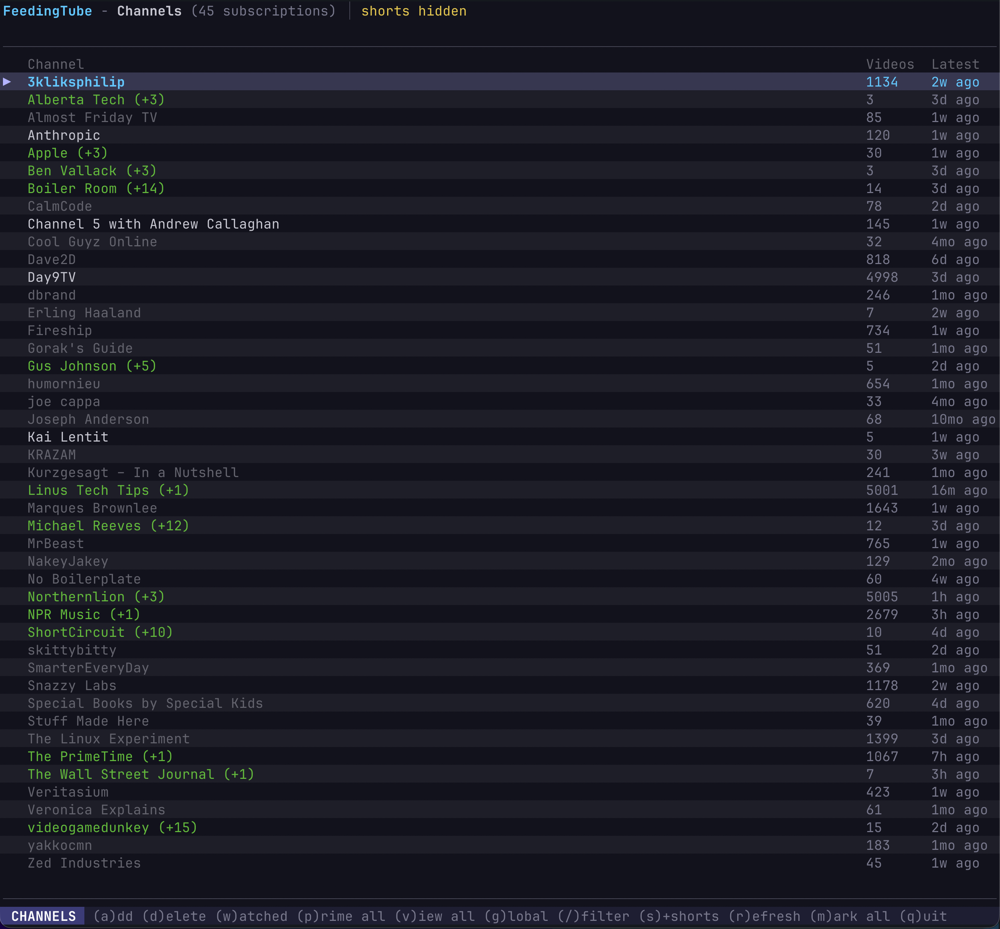
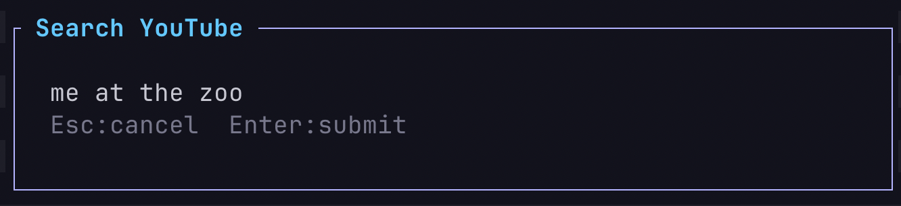

<p align="center">
  
</p>

<h1 align="center">FeedingTube</h1>

<p align="center">A terminal UI for managing YouTube subscriptions and watching videos.

## Install

```bash
curl -fsSL https://raw.githubusercontent.com/jensbech/feeding-tube/main/install | bash
```






## Requirements

- [yt-dlp](https://github.com/yt-dlp/yt-dlp)
- [mpv](https://mpv.io/) (or iina/vlc)

## Usage

```bash
feeding-tube              # launch TUI
feeding-tube -c 1         # open channel 1 directly
feeding-tube --add <url>  # add channel from CLI
feeding-tube --prime      # fetch full history for all channels
feeding-tube --list       # list subscriptions
```

Press `?` in the TUI for keybindings.

## Storage

Data stored in `~/.feeding-tube/data.db` (SQLite).
