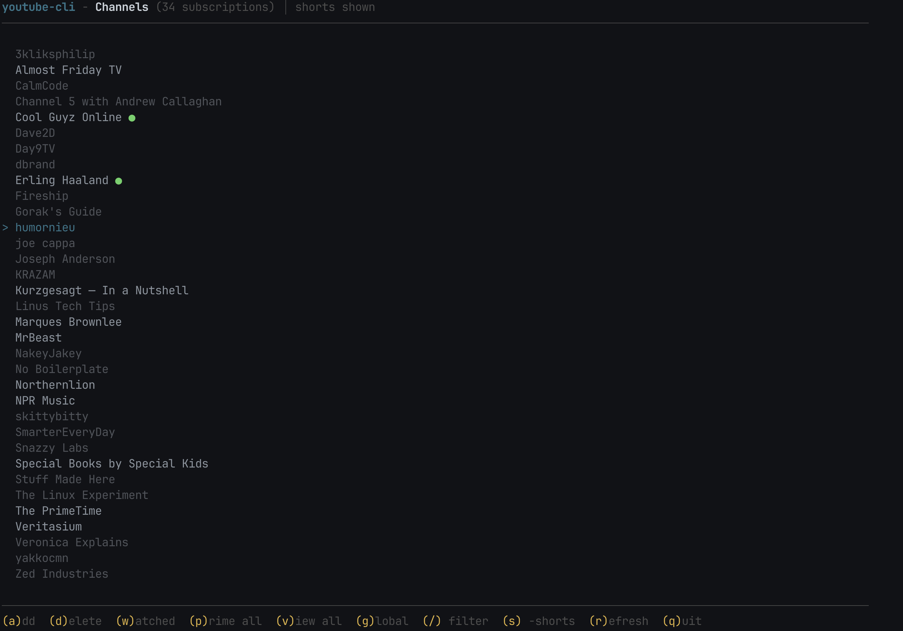

A terminal UI for watching YouTube.
- Add and manage subscriptions.
- Search and watch any video.
- Vibe coded.

## Requirements

- [yt-dlp](https://github.com/yt-dlp/yt-dlp)
- [mpv](https://mpv.io/) (or iina/vlc)
- Node.js 18+



## Setup

```bash
pnpm install
just setup    # or: pnpm build && pnpm link --global
```

## Usage

```bash
youtube-cli              # launch TUI
youtube-cli -v           # view all videos
youtube-cli -c 1         # view channel 1
youtube-cli --add <url>  # add channel
youtube-cli --prime      # fetch full history for all channels
youtube-cli --list       # list subscriptions
```

## Navigation

| Key | Action |
|-----|--------|
| `j/k` or arrows | move |
| `Enter` | play video / browse channel |
| `a` | add subscription |
| `d` | delete subscription |
| `v` | view all videos |
| `n/p` | next/previous page |
| `s` | toggle shorts |
| `/` | filter/search |
| `r` | refresh |
| `b/Esc` | back |
| `q` | quit |

## Features

- **Fast pagination**: ~0.1ms per page (in-memory sorted index cache)
- **Bulk RSS fetch**: 31 channels in ~200ms
- **New video indicators**: Green dot on landing page for channels with unwatched videos (clears when you view that channel)
- **Shorts filtering**: Toggle with `s`
- **Video history**: Track watched videos, persistent history
- **Priming**: Fetch full channel history with `--prime`

## Storage

`~/.config/youtube-cli/`
- `subscriptions.json` - channels + settings
- `videos.json` - video cache
- `watched.json` - watched video IDs
